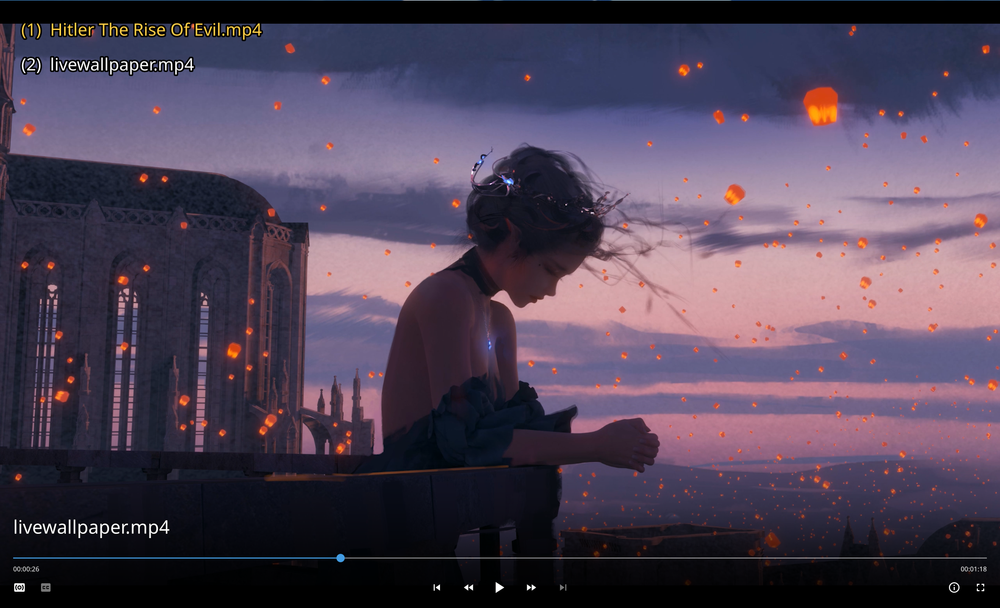
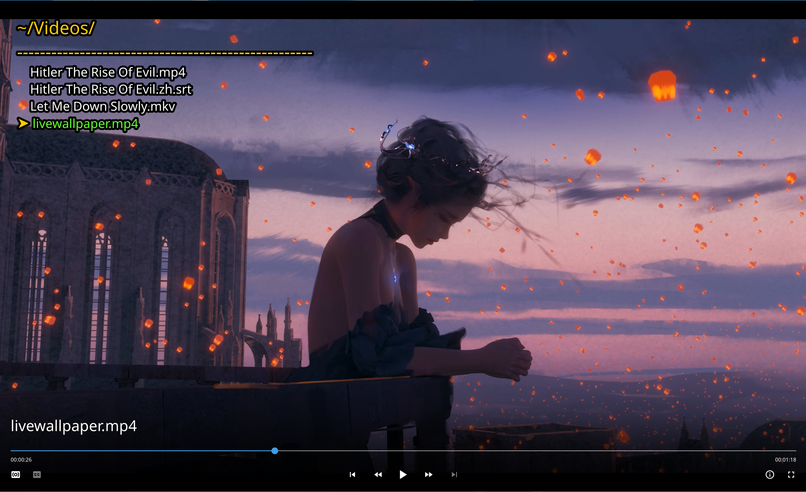
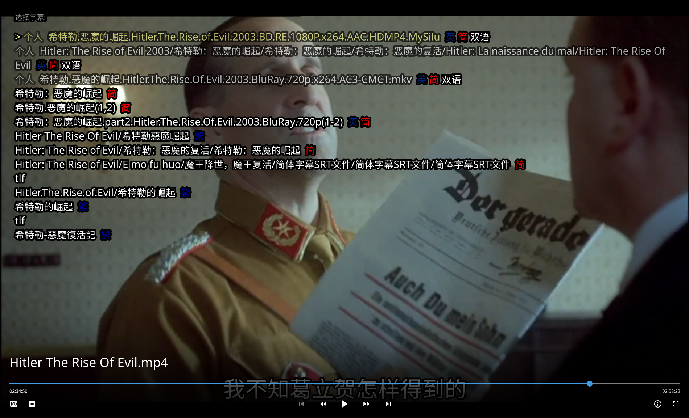
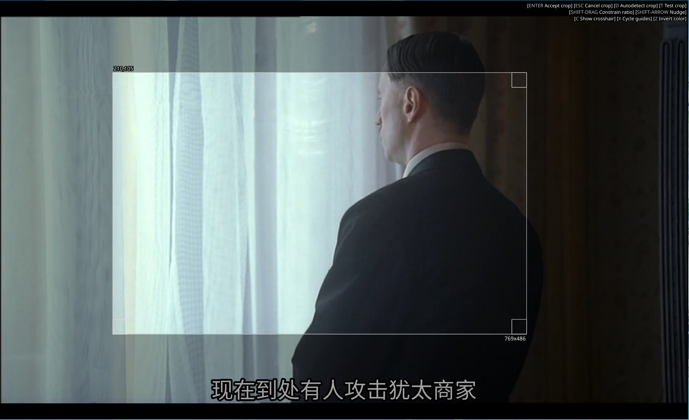

如果是对我有所关注的小伙伴，会发现我之前曾经写过一份 `mpv` 配置，这一份是在我速成了 `lua` 后的升级版，其中包含对 `mpv` 0.33 版本大改的对应修正。

<!--more-->


### 1. 成果展示









配置目录结构如下：

```
.
├── input.conf
├── mpv.conf
├── script-modules
│   ├── file-browser-addons
│   │   ├── addons.md
│   │   ├── apache-browser.lua
│   │   ├── favourites.lua
│   │   ├── ftp-browser.lua
│   │   ├── home-label.lua
│   │   ├── ls.lua
│   │   ├── m3u-browser.lua
│   │   ├── powershell.lua
│   │   └── README.md
│   └── user-input-module.lua
├── script-opts
│   ├── file_browser.conf
│   ├── file-browser-keybinds.json
│   ├── mpv_crop_script.conf
│   └── osc.conf
└── scripts
    ├── assrt.lua
    ├── autoload.lua
    ├── file-browser.lua
    ├── morden.lua
    ├── mpv_crop_script.lua
    ├── recent.lua
    └── user-input.lua
```

### 2. 基本配置

这一部分在 `~/.config/mpv/mpv.conf` 中设置

#### 2.1 硬件加速

在 `archwiki` 有很详细的介绍，这里就不赘叙了。配好 `vaapi` 之后在配置文件中加入

```
# Hardware video acceleration
vo=gpu
hwdec=vaapi
```

#### 2.2 截图设置

我有时候需要给视频快速截图，这是 `mpv` 内置的功能

```
# Screenshot config
screenshot-directory="~/Pictures"
screenshot-format=png
screenshot-tag-colorspace=yes
screenshot-high-bit-depth=yes
screenshot-template="%F-%{estimated-frame-number:%P}"
```

#### 2.3 其他设置

`mpv` 的参数之多是出了名的，我只挑选了一些常用的设置，详细参考 [官方文档](https://mpv.io/manual/stable/)

```
# save last position
save-position-on-quit
# keep open when video ends
keep-open
# remove osd and border 
no-osd-bar
no-border
# remove osc for morden.lua
osc=no
# autoload subtitle with the same name (builtin)
sub-auto=fuzzy
```

### 3. 额外插件

- 播放历史 [recent.lua](https://github.com/hacel/recent)

  注意默认触发按键是 "`" ，这和 console 冲突，我目前是使用 TAB 来触发

- 文件列表 [file-browser](https://github.com/CogentRedTester/mpv-file-browser)

  建议使用 `user-input.lua` 快速打开文件夹，你只需要按 `alt+o` 输入路径就能打开一个文件列表了！默认 `autoload` 是关闭的，这非常合理，毕竟我单独打开文件夹就不是想播放所有的文件

- 更现代的播放栏 [morden.lua](https://github.com/zjuyk/mpv-osc-morden)

  链接里是我的修改版，我还有一些新的想法或许未来会去调整。你说它到底现代在哪？它使用了更现代的 `material design` 符号字体（x

- 区域截图 [mpv_crop_script.lua](https://github.com/TheAMM/mpv_crop_script)

  这个脚本使用了预计要被移除的 `tick` 事件，我会在之后改写。我虽然设置了全局截图，但那只能截取整个界面，有时候我想截取某个区域，这个脚本就派上了用场

- 字幕搜索加载 [assrt.lua](https://github.com/AssrtOSS/mpv-assrt)

  这个脚本目前是从 `assrt.net` 来获取字幕的，电影相关的字幕很多，但是美剧之类的会差一些，我目前没什么需求，以后或许会考虑加点其他的源

### 4. 总结

这份配置需要记忆一定的快捷键，如果你更喜欢点点点，那可能不大适合你。

### 5. 参考链接

- [dotfiles](https://github.com/zjuyk/dotfiles)
- [mpv userscripts](https://github.com/mpv-player/mpv/wiki/User-Scripts)

