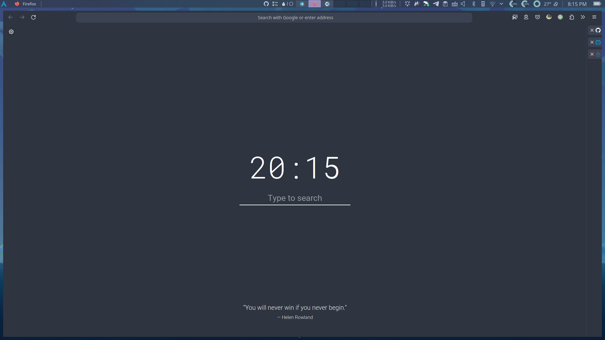
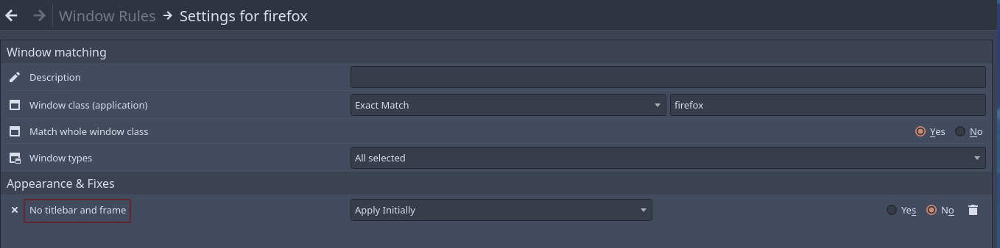
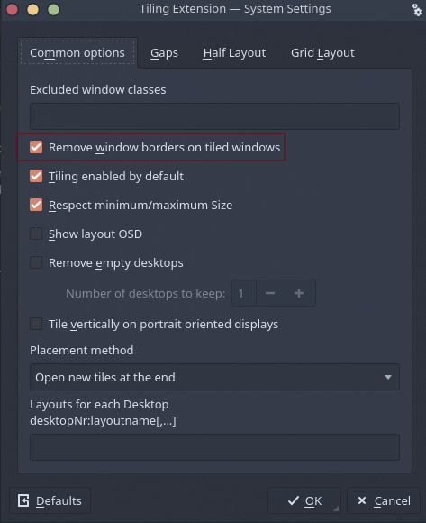
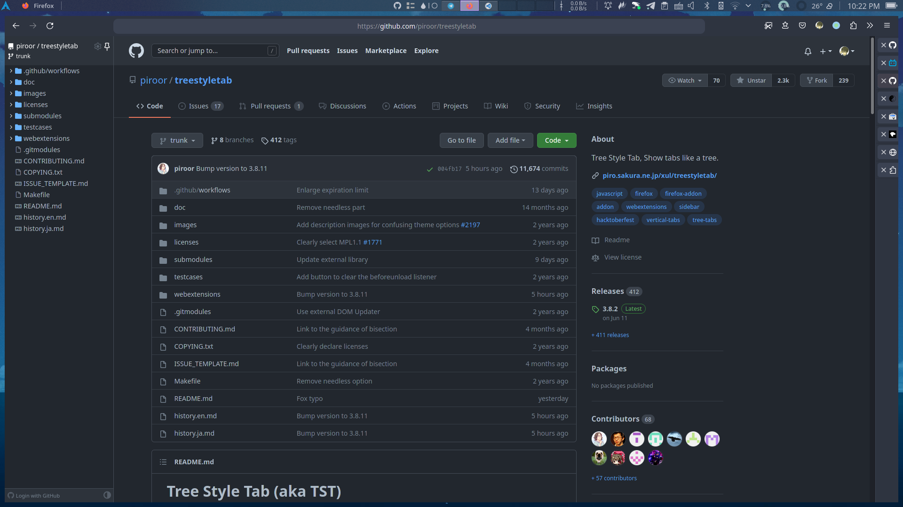
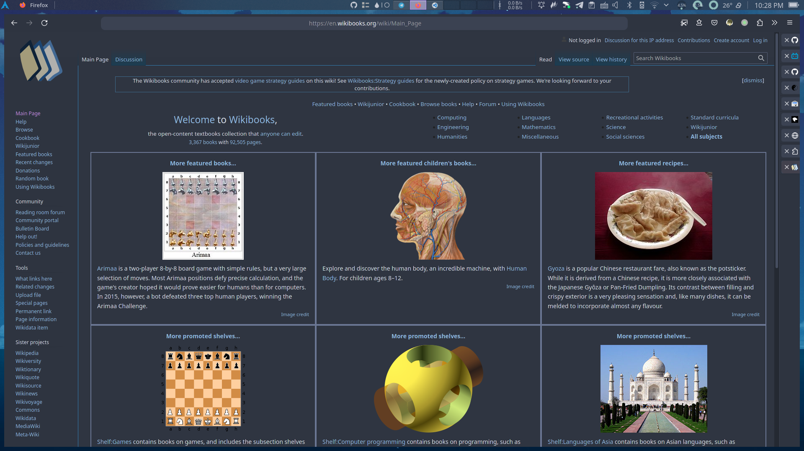
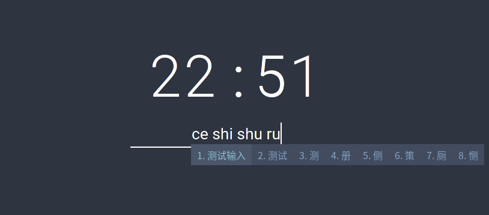
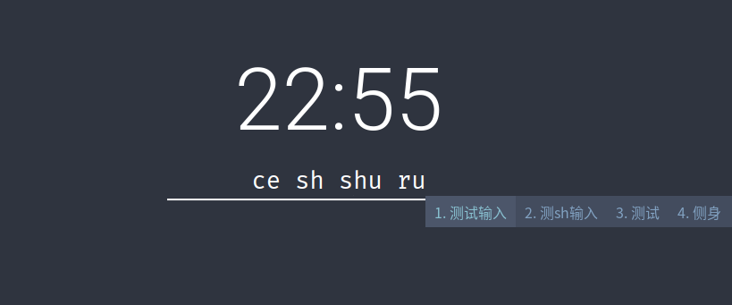

# 我的火狐配置


前些日子看到 `firefox` 流失近 `5000` 万用户量的新闻时悚然一惊，我之前也因为之前火狐长期不活动会卡死的 `bug` 跑到了 `chrome` 避难，没成想火狐已经到了这个地步。在长期不活动卡死的问题修复后我又回到了火狐，但正好遇上 90 版本 `UI` 大改，新的界面设计确实有点劝退人，好在火狐优点之一就是定制化，花了点心思弄了个合用的界面，下面就介绍一下我的具体操作步骤并附上我的插件配置。

&lt;!--more--&gt;

### 1 实现效果

没图没真相，还是先来张效果图



注：我是平铺用户，没有最大化和最小化这样的操作习惯，如果你有的话不建议完全照搬我的配置

### 2 实现流程

#### 2.1 移除标题栏

标题栏是个可有可无的东西，作为平铺用户我并不愿意它挤占屏幕高度。

在 `kde` 上你可以通过 `window rules` 匹配火狐的 `window class` 将窗口边框去除，如下添加 `No titlebar and frame` 属性：



不过注意这样移除边框后就没窗口阴影了（我并不需要这个

如果你和我一样是使用平铺窗口管理器的话，直接在对应的配置文件设置去除边框就行。另外还有使用平铺脚本的用户可以在对应的脚本管理界面勾选去除窗口边框，以 [kwin-tiling](https://github.com/kwin-scripts/kwin-tiling) 这个脚本举例：



#### 2.2 引用外部样式

众所周知，`firefox` 允许加载外部 `css` 来进行定制化。如果你自己 `css` 能力比较强而且时间充裕可以按照[官方文档](https://www.userchrome.org)来自己定制。我并没有自己花太多时间去具体设计，而是选择在 [Firefox-Elegant-NordTheme](https://github.com/rafamadriz/Firefox-Elegant-NordTheme) 基础上进行修改，我认为他的调色很符合我的审美。

先在 `about:config` 允许火狐加载外部样式。

将 `toolkit.legacyUserProfileCustomizations.stylesheets` 设为 `true`，然后按照上面那个项目的说明在火狐配置目录下新建 `chrome` 文件夹并放入 `css` 文件，目录树如下：

```
chrome/
      |- userChrome.css
      |- userContent.css
      |- userColors.css
```
### 3 自定义调整

#### 3.1 移除标签栏

虽然我对那份配置的调色已算满意，但是默认的效果如下：


可以明显发现标签栏的高度实在是有点过了，而且右边的留空极其难看，我本身是 [treestyletab](https://github.com/piroor/treestyletab) 用户，于是准备直接采用垂直标签栏。

```css
#titlebar #TabsToolbar {
  padding: 6px 0px 2px 6px !important;
  background: var(--base_color1) !important;
  visibility: collapse;
}
```

在 `#TabsToolbar` 下加上 `visibility: collapse;` 便可以关掉水平标签。

#### 3.2 定制垂直标签栏

对于 `treestyletab` 推荐采用 `proton` 主题，然后建议采用和火狐主题对应的颜色，我的 `css` 如下：

```css
:root {
--theme-colors-button_active: rgb(0, 221, 255);
}

#background {
    background: #2e3440 !important;
}

tab-item-substance {
  border: solid 1px #00000012; 
}

tab-item.active .background {
  background-color: steelblue;
}

tab-item.active .label-content {
  font-weight: bold;
  font-size: 14px;
}
tab-item.active tab-twisty,
tab-item.active .label-content,
tab-item.active tab-counter {
  color: #fff;
}

tab-item:not(.active) .background {
  background-color: #3b4252;
}

tab-item:not(.active) .label {
  color: #ffff !important;
}

tab-item tab-item-substance:hover {
  background: #5A89B7 !important;
}

.newtab-button {
  background: #2e3440 !important;
}
```

你可以根据 [官方文档](https://github.com/piroor/treestyletab/wiki/Code-snippets-for-custom-style-rules#for-version-2x) 来进一步定制

#### 3.3 额外小技巧

**移除 `treestyletab` Header，也就是侧边栏上面那个切换头**

在 `userChrome.css` 加上
```css
/* only remove TST headers */
#sidebar-box[sidebarcommand=&#34;treestyletab_piro_sakura_ne_jp-sidebar-action&#34;] #sidebar-header {
  display: none; /* remove sidebar header */
  border-color: var(--base_color2) !important;
}
```

**设置垂直标签栏悬浮显示，也就是默认贴边变小，鼠标悬浮弹出**

在 `userChrome.css` 加上
```css
/* The default sidebar width. */
#sidebar-box {
  overflow: hidden!important;
  position: relative!important;
  transition: all 100ms!important;
  min-width: 40px !important;
  max-width: 300px !important;
}

/* The sidebar width when hovered. */
#sidebar-box #sidebar,#sidebar-box:hover {
  transition: all 100ms!important;
  min-width: 300px !important;
  max-width: 300px !important;
}
```

**设置侧边栏分隔线宽度**

在 `userChrome.css` 加上
```css
.sidebar-splitter {
  /* display: none;  remove sidebar split line */
  min-width: 1px !important;
  max-width: 1px !important;
  border-color: var(--base_color2) !important;
}
```

### 4 我的扩展

- [SwitchyOmega](https://github.com/FelisCatus/SwitchyOmega)
  
  代理扩展，懂的都懂

- [saladict](https://saladict.crimx.com/)
  
  划词翻译插件，支持 PDF，读论文的福音

- [Plasma Integration](http://kde.org/)
  
  可以和 KDE 良好的整合在一起， 播放和下载通知与 KDE 嵌合

- [Tampermonkey](https://www.tampermonkey.net/)
  
  不可或缺的浏览器插件，不管是用其他人的脚本还是自己写用处都极大

  - [Endless Google](https://openuserjs.org/scripts/tumpio/Endless_Google)
    
    搜索引擎不再只有第一页，不用再手动点击下一页了

  - [Google Images direct link](https://greasyfork.org/scripts/3187)

    获取谷歌搜索的图片直链

- [Octotree](https://www.octotree.io/)
  
  在侧边栏显示 `github` 仓库目录
  

- [QR Code](https://c7x.me/)
  
  生成和识别二维码

- [OneTab](http://www.one-tab.com/)
  
  暂时保存标签组，适合干活干到一半临时有事的情况

- [Midnight Lizard](https://midnight-lizard.org/)

  网页配色调整插件，我习惯给网页调配上统一的 `nord` 配色
  

- [Tabliss](https://tabliss.io/)

  用来提供新标签页的插件，在我上面的截图有体现

- [User-Agent Switcher and Manager](https://add0n.com/useragent-switcher.html)

  有时候网站会限制 UA，所以需要用这个插件来切换

- [Tree Style Tab](http://piro.sakura.ne.jp/xul/_treestyletab.html.en)
  
  这个上面已经重点介绍过了，用来展示树形标签页的

- [uBlock Origin](https://github.com/gorhill/uBlock#ublock-origin)

  广告拦截插件，就我的体验上来说还行

### 5 特殊设置

#### 5.1 硬件加速

具体参见 [Arch wiki](https://wiki.archlinux.org/title/Firefox#Hardware_video_acceleration)

#### 5.2 使用 QT 文件对话框

先在 `about:config` 将 `widget.use-xdg-desktop-portal` 调成 `true`，再安装 `xdg-desktop-portal{,-kde}` 这两个包即可，但注意这会导致火狐一直认为自己不是默认浏览器，所以自己决定。

### 6 注意点

- 目前网页截图在 `wayland` 下还无法复制
  
- 目前 `91.02 stable` 版本全局菜单还不支持，需要打 `patch`，可以安装 `firefox-appmenu` 来临时解决该问题

- 火狐没有传递当前输入光标位置给 `fcitx5` 所以开启单行模式会停留在预编辑区首部

  
  
  而 `chrome` 是支持的
  
  


### 7 参考和我的配置

- [我的配置](https://github.com/zjuyk/dotfiles)
- [Firefox-Elegant-NordTheme](https://github.com/rafamadriz/Firefox-Elegant-NordTheme)
- [TreeStyleTab wiki](https://github.com/piroor/treestyletab/wiki)
- [Arch wiki](https://wiki.archlinux.org/title/Firefox#Hardware_video_acceleration)


---

> 作者: [千玄子](https://zjuyk.site)  
> URL: https://blog.zjuyk.site/posts/custom-firefox/  

