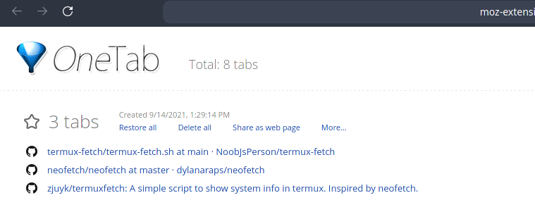
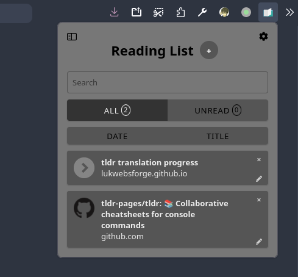
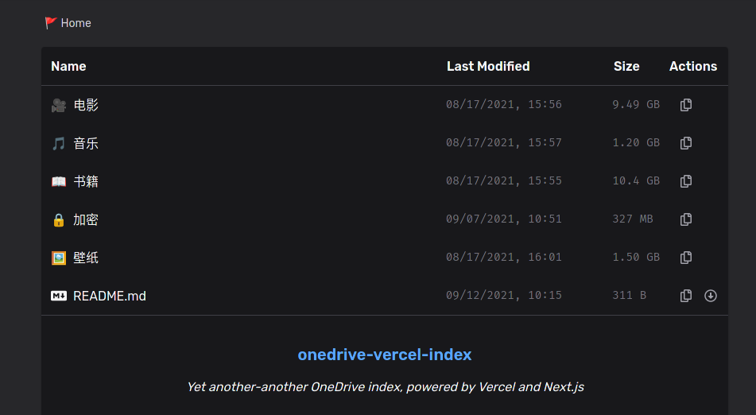

# 只收藏却不阅读

我曾经很喜欢收集一些有用的资源，尤其在我认真思索如何搜索到合适的资源之后。但当我在收藏夹又顺手加入一个 `awesome` 前缀的 `github` 仓库时，我突然愣住了。回望收藏夹，东西好多呀，但我真正读过的东西又占多少呢？

&lt;!--more--&gt;

**我收藏了，但是我并没有学到东西**！我像一只仓鼠收藏着觉得好吃的坚果，但吃东西才是我的初衷，收藏并不是。经过反思，接下来的时间我要停一停，做一点磨刀的事情。

## 分类归纳

我的收藏夹主要有三个地方，我的 Telegram 私人频道、火狐浏览器书签和 Onedrive 网盘。

前者是我收藏夹的核心，这里面主要是我收藏的有用的轮子、别人优秀的配置和我对一些问题的解决方案。我浏览器的书签分为两种，一种是常用的入口，例如 Arch Wiki、Gentoo Wiki 以及我常用的 B 站等，这部分我放在书签栏。另一种是临时需要查看的标签页，它们通常是一组页面，如果这是我过段时间需要查看而且只需要查看一次的东西，我会把他们临时归档到 onetab 一并先收藏起来，例如我写代码时开启的多个文档页面。

如果这是我一段时间的日常任务我会把它们放到 Reading List 里保存，例如我日常做的翻译工作 tldr。

对于一些大文件，我会存放到 Onedrive 网盘，例如比较触动我的电影、我喜欢看的书籍和音乐壁纸等等。

## 懂得取舍

收藏的东西可以无限，因为电子资源在当今这个时代已经越来越丰富了。我现在要做的事情就是把没必要的东西刨除出去，我的精力是有限的，没办法全都仔仔细细去看，不在我 todolist 里的东西我会把它们放在角落里吃灰，因为它们对现在的我并无价值，如果时间充裕我也会尝试去把过时的收藏项移除。

## 沉淀积累

**看了不代表懂了，那些还是别人的东西**。那些轮子很好用，那我为什么不尝试用他们做出点小作品出来？别人的优秀配置很好，我也可以学着捏一份自己的。还有我看过的有感触的电影，不妨写几篇影评。至于我喜欢看的书，写书评倒还不在我的计划之内，因为我有做标注的习惯。

## 坚持不懈

给懒惰的自己再敲个警钟，前面说了那么多，坚持不下来都是白费功夫，持之以恒才能见成效，诸君共勉～

---

> 作者: [千玄子](https://zjuyk.site)  
> URL: http://localhost:1313/posts/collect-but-do-not-read/  

