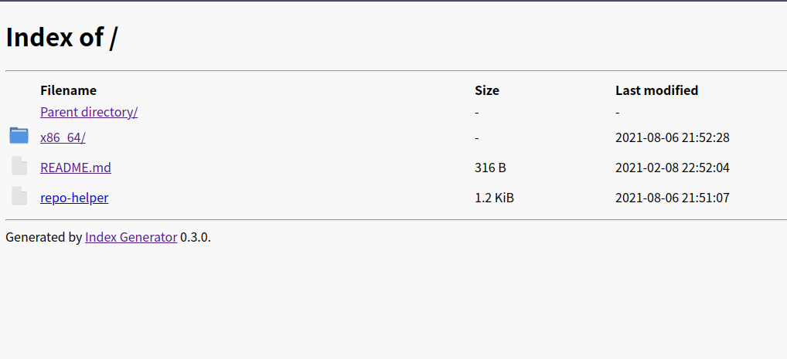

# 自建 ArchLinux 个人源


在 `wps-office` 因为分发许可的原因移出 `archlinuxcn` 源之后，自建一个 `arch repo` 的需求就越来越强烈，我之前也搞过 `github action` 来打 `archlinux` 的包，但并不能完全满足我的需求，于是我准备大刀阔斧改上一波，并写点脚本辅助自动化打包流程。


&lt;!--more--&gt;

这篇文章可能会有点长，因为我打算把我的踩坑过程也写进去，没时间看的可以直接到文末我的仓库链接查看具体实现。

# 1 需求分析

|需求|预计解决方案|
|:-|:-|
|定时打包|`github action cron`|
|打完的时候通知|`telegram bot api`|
|能够打有依赖在 AUR 的包|`aur helper yay`|
|打自己修改过的 `PKGBUILD`|保证目录形式以兼容 `aurpublish`，以文件夹的形式上传|
|有一个 `web` 页面提供单独的下载，因为用户不一定都愿意导入你的 key|目前选用`keybase`|


## 2 具体思路

首先想到的当然是依云写的 [lilac](https://github.com/archlinuxcn/lilac) 啦，但我看了看，貌似远远高于我的需求，我只是想打几个类似于 wps-office 这样的包应该用 github action 就能搞定，不过完全可以借鉴思路。

这里顺便提一下两位群友的方案：[GitHub Actions 打造 AUR 打包下载一条龙服务](https://viflythink.com/Use_GitHubActions_to_build_AUR/) 和 [利用 GitHub Actions 编译 AUR 包并建立自己的软件源](https://www.aloxaf.com/2020/06/build_aur_with_github_actions/)，我接下来的操作和他们有很大的相似之处，只有一些具体细节并不相同。

### 2.1 解决 docker 权限问题

`makepkg` 和 `yay` 因为[安全原因](https://lists.archlinux.org/pipermail/pacman-dev/2014-March/018911.html)不允许在 `root` 下运行。这是有点糟心的，`docker` 默认不就是 `root` 么，群友 [DuckSoft](https://www.ducksoft.site/) 提供了一个 `dirty hack` 来让 `makepkg` 在 `root` 下运行

```bash
sed -i &#39;/E_ROOT/d&#39; /usr/bin/makepkg
```

这下好了，可以打没有依赖在 `AUR` 的包了，就像下面三行就完事了

```bash
# entrypoint.sh
git clone &#34;https://aur.archlinux.org/$1.git&#34;
cd &#34;$1&#34;
makepkg -sf --noconfirm
```

但是 `yay` 还是不能在 `root` 下运行，于是乎想到新建一个没有密码的普通用户然后通过解析 `.SRCINFO` 来递归安装依赖，这是 [edlanglois/pkgbuild-action](https://github.com/edlanglois/pkgbuild-action) 的做法。

```bash
# Extract dependencies from .SRCINFO (depends or depends_x86_64) and install
mapfile -t PKGDEPS &lt; \
	&lt;(sed -n -e &#39;s/^[[:space:]]*\(make\)\?depends\(_x86_64\)\? = \([[:alnum:][:punct:]]*\)[[:space:]]*$/\3/p&#39; .SRCINFO)
sudo -H -u builder yay --sync --noconfirm &#34;${PKGDEPS[@]}&#34;
```

我具体看了看他的实现，感觉做法过于复杂了，而且在 `root` 下采用 `sudo -u` 还要额外考虑传递环境变量的问题。难道就没有一个内置 `yay` 并默认是普通用户的 `docker` 上游吗？

嗯，终于等到你 [martynas/archlinux](https://hub.docker.com/r/martynas/archlinux)，它内置了 `yay` 用来构建 `AUR` 包并且有个默认的名为 `build` 的 `passwordless` 用户，事情瞬间变得简单多了，这里是我写的 [pkgbuild-aur](https://github.com/zjuyk/pkgbuild-aur)。


### 2.2 同时管理自己修改过的 PKGBUILD 和 AUR

为了能够同时方便的使用 `aurpublish` 来管理我自己手里的 `AUR` 包，我采用了以下的目录要求

```bash
# there should be a subdirectory with the same name of pkgname to satisfy `aurpublish`
if [[ ! -d $pkgbuild_dir ]]; then
    echo &#34;$pkgbuild_dir should be a directory.&#34;
    exit 1
fi

if [[ ! -e $pkgbuild_dir/PKGBUILD ]]; then
    echo &#34;$pkgbuild_dir does not contain a PKGBUILD file.&#34;
    exit 1
fi

if [[ ! -e $pkgbuild_dir/.SRCINFO ]]; then
    echo &#34;$pkgbuild_dir does not contain a .SRCINFO file.&#34;
    exit 1
fi
```

需要在项目根目录下放置与包同名的文件夹，同时里面要包含 `PKGBUILD` 和 `.SRCINFO`，后者是 `AUR web` 的必须要求同时也用来解析依赖，可以通过 `makepkg --printsrcinfo &gt; .SRCINFO` 来生成。

同时要注意最好先改一下目录权限，[据说](https://github.com/2m/arch-pkgbuild-builder/blob/153f46bb4c3aea1d723a3f2651c867de46658181/entrypoint.sh#L39) `/github/workspace` 默认 `owner` 是 `root`，所以推荐如下改动。

```bash
# fix directory permissions
sudo chown -R build &#34;$pkgbuild_dir&#34;
sudo chown -R build /github/home
```

### 2.3 定时打包以及完成之后通知我

首先 `github action` 就支持 `cron` 定时，详见[文档](https://docs.github.com/en/actions/reference/workflow-syntax-for-github-actions#onschedule)，作为一名良心资本家，我允许它周末休息，遵循 `996` 每天只干两次活。

```yml
on:
  push:
    branches:
      - master
  schedule:
    - cron: &#39;0 9,21 * * 1-6&#39; # build pkgs via 996 rules (；′⌒`)
  workflow_dispatch: # allow manual trigger
```
当然我开启了每次 `push` 运行和手动开启运行 `CI` 以便随时压榨（

`github action` 失败的话会有邮件提醒，但为了维护自己的个人源在 `build` 成功的时候我也需要提醒。这时候 [oldherl](https://github.com/oldherl) 提醒了我，为什么不试试 `telegram bot api` 呢？这着实是个好主意，我翻查了一下文档，究极简单，以后提醒不用邮件了，全改用 `telegram`，顺便推荐比较完善的 [telegram-action](https://github.com/appleboy/telegram-action)。

### 2.4 打包之后的存放位置

首选当然是 `github release` 啦，我预想是将 `github release` 当成一个 `archive repo`，里面存放着前几个版本的包。Arch 是滚动更新的，自己的个人源自然只放最新的版本包，我目前选用的是 `keybase`，因为它提供 250 G 免费直链网盘和一个免费二级域名（这不就巧了么，正好符合需求），于是我写了个 [repo-helper](https://zjuyk.keybase.pub/repo-helper) 方便使用

```bash
#!/usr/bin/bash

# Usage:
# ./repo-helper add &lt;pkg_file_name&gt;     # add package
# ./repo-helper remove &lt;pkgname&gt;        # remove package
# ./repo-helper list                    # list packages in repo
# ./repo-helper pull                    # download packages from personal github release

repo_name=&#34;zjuyk&#34;
repo_ext=&#34;.db.tar.gz&#34;
repo_dir=&#34;/run/user/1000/keybase/kbfs/public/$repo_name/x86_64/&#34;
github_release_url=&#34;https://api.github.com/repos/zjuyk/repo/releases/latest&#34;

db_path=$repo_dir$repo_name$repo_ext

case $1 in
        pull)
                echo &#34;Pull update from github release...&#34;
                curl -s $github_release_url | \
                        grep browser_download_url | \
                        cut -d : -f 2,3 | \
                        tr -d \&#34; | \
                        xargs -n 1 curl -O -sSL -o $repo_dir -C -
                repo-add $db_path $repo_dir/*.zst --remove --sign --quiet
                index-generator --human $repo_dir
                echo &#34;Done!&#34;
                ;;
        add)
                echo &#34;Add $2 to $repo_name...&#34;
                mv -n ./$2 $repo_dir
                repo-add $db_path $repo_dir/$2 --remove --sign --quiet
                index-generator --human $repo_dir
                echo &#34;Done!&#34;
                ;;
        remove)
                echo &#34;Remove $2 from $repo_name...&#34;
                repo-remove $db_path $2
                index-generator --human $repo_dir
                echo &#34;Done!&#34;
                ;;
        list)
                ls $repo_dir/*.zst | sed &#39;s/-x86_64.pkg.tar.zst//g&#39; | awk -F &#34;/&#34; &#39;{print $NF}&#39;
                ;;
        *)
                echo &#34;args should be one of &#39;pull&#39;, &#39;add&#39;, &#39;remove&#39; and &#39;list&#39;!&#34;
esac
```

脚本中的 [index-generator](https://github.com/index-generator-project/index-generator) 是 [兔兔](https://brucezhang1993.github.io/) 他们在几年前用 `Jinja` 写的，我打算有时间的话用 `rust` 的 [tera](https://github.com/keats/tera) 库重构一个。




### 2.5 维护更新

说到检查版本首先想到的就是依云的 [nvchecker](https://github.com/lilydjwg/nvchecker) 写个配置文件跑一跑，然后改一下包信息就完事了

```bash
# bump pkg version in PKGBUILD
# update checksums
$ updpkgsums
# update .SRCINFO
$ makepkg --printsrcinfo &gt; .SRCINFO
```

## 3 不足与改进计划

- 因为 `keybase` 非常注重安全性，所以我没办法直接从 `github` 将产物推到 `keybase` 上（也许可以，但也会十分复杂，需要专用的工具）。这导致我目前只能半自动化，需要手动 `pull release` 到运行着 `keybase` 的机器上同步。虽然可以定时运行，但 `keybase` 本身的运行会占用一定的资源，~~我正在考虑是否直接塞到 `github repo` 里然后开 `github pages`~~（属于对 `github` 的究极滥用，实际上我不会考虑这么做）

- `ArchLinux` 除了 `x86_64` 架构外还额外划分了 `any`，这个我目前没有考虑，因为目前我并没有维护 `any` 的包，或许以后会加入


- 同步是需要消耗流量的，出于未来保留若干版本包用于回滚的考虑，我目前是用 `api` 把所有的 `release` 全下下来了，没有做筛选，如果代理流量不够的话建议开一个 `cloudflare worker` 做反代

## 4 链接

- [repo](https://github.com/zjuyk/archrepo)
- [keybase](https://zjuyk.keybase.pub)
- [pkgbuild-aur](https://github.com/zjuyk/pkgbuild-aur)
 


---

> 作者: [千玄子](https://zjuyk.site)  
> URL: http://localhost:1313/posts/personal-archlinux-repo/  

